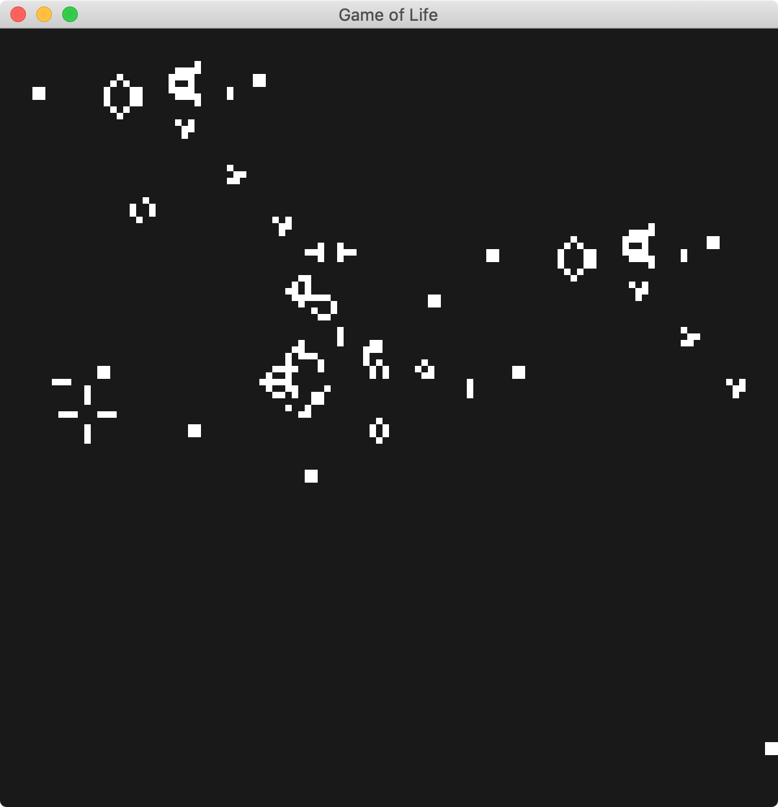

# Conway's Game of Life

My implementation of Conway's Game of Life in Rust. It uses a Piston game engine to render the graphics window.

GOL theory: https://en.wikipedia.org/wiki/Conway%27s_Game_of_Life

### Patterns Implemented  
Type | Pattern
---- | -------
Oscillator | Toad
Spaceship | Simple glider
Spaceship | Edge repairing spaceship
Gun | Gosper glider gun

### Usage
```
git clone https://github.com/jdansev/game-of-life
cd game-of-life
cargo run
```
