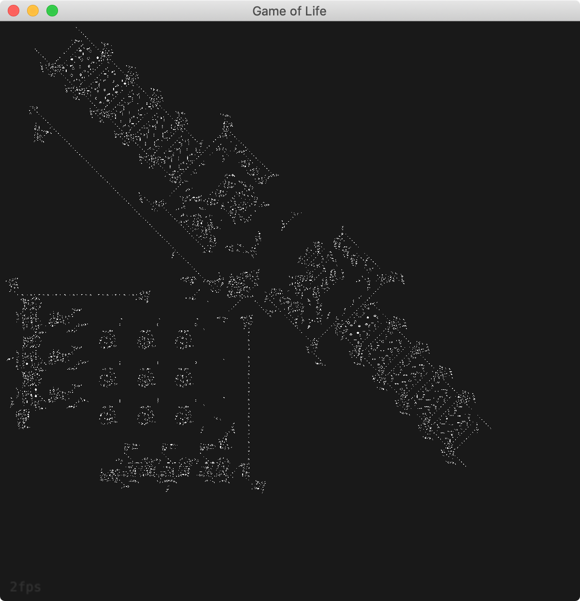

# Conway's Game of Life

<p align="left">
  
  <br/>Pattern: Turing Machine
</p>


*Conway's Game of Life* is a fascinating cellular automaton. This is my implementation of the game in Rust, built on a Piston game engine. Theory: https://en.wikipedia.org/wiki/Conway%27s_Game_of_Life

### Usage
```
git clone https://github.com/jdansev/game-of-life
cd game-of-life
sh download-patterns.sh
cargo run --release
```

### Patterns
Patterns are downloaded with the script `download-patterns.sh` which come as 1896 .rle (run-length encoded) files. This must be done before running. My program includes a decoder that can parse this format and use it to seed the game board.

### Performance
My version of Life is implemented using bit manipulation techniques and a fixed sized 64 bit array. This particular  implementation was chosen over dynamic implementations like vectors for maximum performance. The tradeoff is that changing the game size requires modifying the config.rs, since the size of this type of array must be known by Rust at compile time.
Note that the game size must be in the form of 64 * 2^n.

And here are a few benchmarks I ran at different sizes:

Size | FPS | ms/Generation
-----|-----|----------
256x256 | 60fps+ | 0.016ms
512x512 | ~50fps | 0.020ms
1024x1024 | ~24fps | 0.042ms
2048x2048 | ~2fps | 0.50ms
